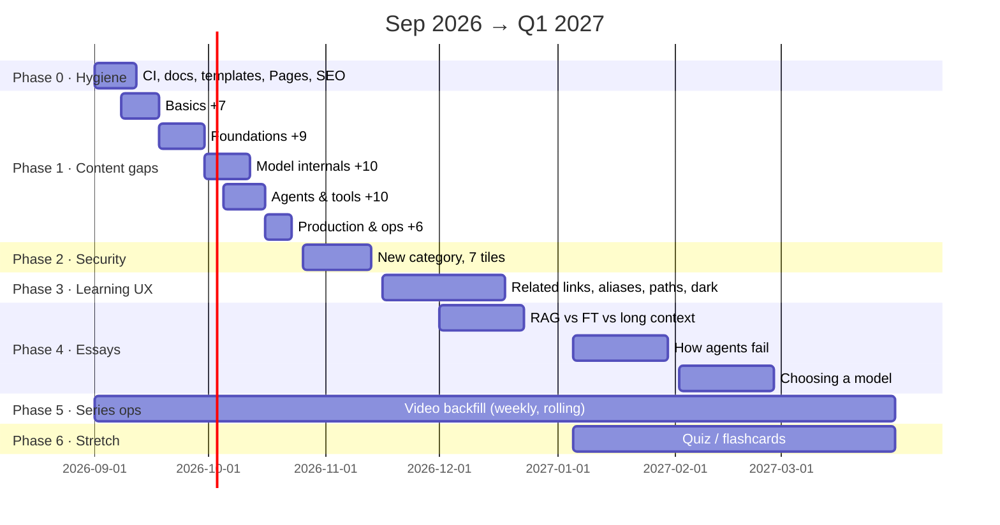

# Roadmap — Agents & LLMs knowledge base

*Snapshot: August 31, 2026. Live checklist: [roadmap tracker #26](https://github.com/konradcinkusz/agents-and-llms/issues/26). This file explains the plan; the tracker shows the state.*

## Where the project is today

- **91 concept tiles** in [`concepts.json`](concepts.json) across six categories:
  Absolute basics (15) · Foundations (14) · Model internals (15) · Agents & tools (24) · Production & ops (16) · Security & safety (7)
- **Three pages**: the searchable knowledge base ([`index.html`](index.html)) and two essays
  ([`architecture.html`](architecture.html), [`mcp-vs-rest.html`](mcp-vs-rest.html))
- **Zero published video links** — every tile still has `videoUrl: ""`
- **CI, contributing docs and issue templates are in place** — every push and PR runs
  `node scripts/validate.mjs`, which checks `concepts.json` against the same rules as
  [`concepts.schema.json`](concepts.schema.json) and verifies every `index.html#<id>` link
  in the pages resolves; [`CONTRIBUTING.md`](CONTRIBUTING.md) is the field and style
  reference. Prose is still hand-checked.

## North star

The reference companion for the "Agents & LLMs" shorts series: **every concept a viewer
meets has a tile** (one plain-language sentence, one nuance sentence, a snippet or diagram
when it earns its place), every tile eventually has its short, and the essays cover the
debates a 60-second short can't. Static files, JSON as the only database, no build step —
that constraint is a feature and stays.

## Timeline

| Phase | When | Theme | Issues | Done when |
|---|---|---|---|---|
| **0** | Sep 1–12, 2026 | Repo hygiene & publishing | [#6](https://github.com/konradcinkusz/agents-and-llms/issues/6) [#7](https://github.com/konradcinkusz/agents-and-llms/issues/7) [#8](https://github.com/konradcinkusz/agents-and-llms/issues/8) [#9](https://github.com/konradcinkusz/agents-and-llms/issues/9) [#10](https://github.com/konradcinkusz/agents-and-llms/issues/10) | CI green on PRs, live URL in README, shared links render preview cards |
| **1** | Sep 8 – Oct 23, 2026 | Fill the five existing categories | [#11](https://github.com/konradcinkusz/agents-and-llms/issues/11) [#12](https://github.com/konradcinkusz/agents-and-llms/issues/12) [#13](https://github.com/konradcinkusz/agents-and-llms/issues/13) [#14](https://github.com/konradcinkusz/agents-and-llms/issues/14) [#15](https://github.com/konradcinkusz/agents-and-llms/issues/15) | 42 → **84 tiles**, no category below its target bar |
| **2** | Oct 26 – Nov 13, 2026 | New category: Security & safety | [#16](https://github.com/konradcinkusz/agents-and-llms/issues/16) | 84 → **91 tiles**, `?kind=sec` chip live |
| **3** | Nov 16 – Dec 18, 2026 | Learning experience | [#17](https://github.com/konradcinkusz/agents-and-llms/issues/17) [#18](https://github.com/konradcinkusz/agents-and-llms/issues/18) [#19](https://github.com/konradcinkusz/agents-and-llms/issues/19) [#20](https://github.com/konradcinkusz/agents-and-llms/issues/20) | "See also" on tiles, aliases searchable, one clickable syllabus, dark mode |
| **4** | Dec 2026 – Feb 2027 | Essays (one per month) | [#21](https://github.com/konradcinkusz/agents-and-llms/issues/21) [#22](https://github.com/konradcinkusz/agents-and-llms/issues/22) [#23](https://github.com/konradcinkusz/agents-and-llms/issues/23) | Three new essay tabs, each linking into tile anchors |
| **5** | Weekly, ongoing | Series operations | [#24](https://github.com/konradcinkusz/agents-and-llms/issues/24) | Rolling: no published short a week without its `videoUrl` |
| **6** | Q1 2027 | Stretch | [#25](https://github.com/konradcinkusz/agents-and-llms/issues/25) | Quiz mode over existing JSON — optional, nothing depends on it |

Phases 0–2 are sequenced by dependency (CI before bulk content, content before the essays
that link into it). Phase 5 runs in parallel with everything from day one. Dates are
targets, not promises — content lands in `concepts.json` **ahead** of its short, so the
site always leads the channel, never trails it.

## The content plan (what the knowledge base should also contain)

Phase 1–2 grow the base from 42 to ~91 tiles. The full proposed lists with per-tile
angles live in the issues; the shape of the gap:

**Absolute basics — 8 → 15** ([#11](https://github.com/konradcinkusz/agents-and-llms/issues/11)):
knowledge cutoff · fine-tuning · open-weights vs closed · why GPUs · chatbot→copilot→agent
ladder · multimodal models · reasoning models

**Foundations — 5 → 14** ([#12](https://github.com/konradcinkusz/agents-and-llms/issues/12)):
system prompt · top-p/top-k sampling · few-shot · chain of thought · structured output /
JSON mode · streaming · max tokens & stop sequences · token pricing · context rot

**Model internals — 5 → 15** ([#13](https://github.com/konradcinkusz/agents-and-llms/issues/13)):
KV cache *(the README's own example, never added)* · tokenizer/BPE · decoder-only &
causal masking · pretraining vs post-training · RLHF · mixture of experts · quantization ·
LoRA · distillation · speculative decoding

**Agents & tools — 14 → 24** ([#14](https://github.com/konradcinkusz/agents-and-llms/issues/14)):
planning vs reacting · reflection · subagents · computer use · code execution · vector
databases · chunking · reranking · context compaction · AGENTS.md/CLAUDE.md convention

**Production & ops — 10 → 16** ([#15](https://github.com/konradcinkusz/agents-and-llms/issues/15)):
cost engineering · model routing · prompt caching · retries & fallbacks · prompt
versioning · batch processing

**Security & safety — new, 7** ([#16](https://github.com/konradcinkusz/agents-and-llms/issues/16)):
prompt injection · jailbreak vs injection · the lethal trifecta · least privilege ·
sandboxing · PII boundaries · red-teaming

That's ~49 tiles of new material — roughly **a year of weekly shorts** already scripted at
the one-sentence level.

## Operating cadence (Phase 5, forever)

1. Pick the next concept (learning-path order once [#19](https://github.com/konradcinkusz/agents-and-llms/issues/19) lands; category order until then).
2. Add its JSON object with `videoUrl: ""` → PR → CI validates → merge → Pages deploys.
3. Record and publish the short.
4. One-line PR fills `videoUrl`; pin a comment on the short linking `index.html#<id>`.
5. Tick the tile off in [#24](https://github.com/konradcinkusz/agents-and-llms/issues/24).

## Non-goals

- **No backend, no build step, no framework.** The page stays a static HTML file that
  `fetch()`es one JSON file. Anything on this roadmap that can't be done under that
  constraint gets redesigned until it can.
- **No model-of-the-month content.** Tiles and essays name durable concepts and axes,
  not leaderboard entries — nothing here should need a rewrite each release cycle.
- **No breaking anchors.** Tile `id`s are permanent once merged; pinned YouTube comments
  depend on them.
